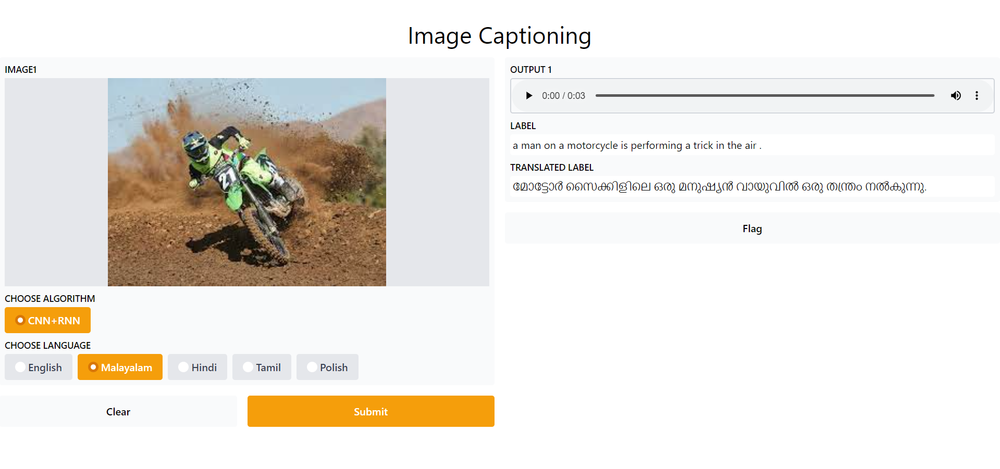
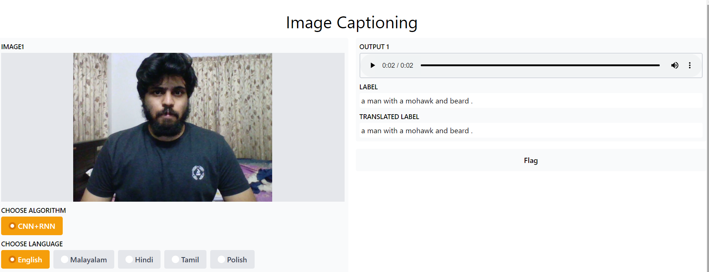

# Image-Captioning-with-Inception-LSTM

An image captioning model that uses flickr8k dataset with Deep learning and NLP

Reference : -> https://arxiv.org/abs/1502.03044

This repo containes many models. Download the models,weights and files from: https://drive.google.com/drive/folders/1ThbT5oBHeZ83TyUisJUe9KRyfW2q9aJj

Download the dataset used: https://www.kaggle.com/dataset/e1cd22253a9b23b073794872bf565648ddbe4f17e7fa9e74766ad3707141adeb Then set images folder, captions.txt inside a folder Flickr8k.

flikr8k/images/

flikr8k/captions.txt

Steps to run:

Run webcam_test.ipynb to test webcam and test.ipynb to upload caption and test.

Working:

Upload any image:

Use Webcam:

